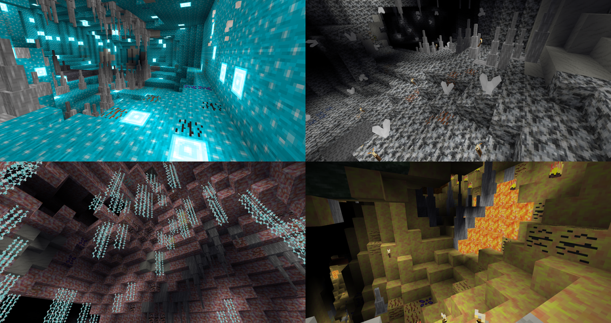

# Underground Challenge [`underch`]

This is a fork of [this mod](https://gitlab.com/h2mm/underch) for the minetest game

## Changes

* The depth of the levels is set in the settings
* The ore is located in stones with the correct texture
* The flood of water and lava has been removed
* Lava Crack generate permanent fire instead of lava source
* Obscurite removed
* Reduced the amount of slime and dynamic blocks
* Localization added

## Layers

There are 55 biomes left in total
Some biomes have been removed/changed/reordered:
* Layer 1: simple stones without decorations and slime
* Layer 2: simple stones with decorations (moss, mushrooms, vines, torches, etc.)
* Layer 3: variegated stones with their decorations (sichamine, omphyrite, emutite, hektorite)
* Layer 4: dark and slimy stones (vindesite, dark vindesite and slimestones)
